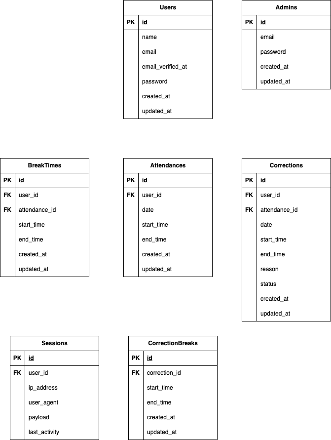

# COACHTECH勤怠管理アプリ

## 概要
このプロジェクトは、勤怠管理のためのアプリです。 
一般ユーザー 又は 管理者ユーザー のマルチログイン方式です。 
一般ユーザーは、会員登録・ログイン・打刻による勤怠登録・月毎の勤怠確認・勤怠情報の修正申請を行うことができます。 
管理者ユーザーは、日毎又はユーザー毎の勤怠確認・ユーザー情報確認・勤怠情報の修正承認を行うことができます。
### 注意事項
- このアプリは日跨ぎ勤務には対応していません。
- 勤怠情報の修正について、勤務実績があるにも関わらずその実績を消す修正は必要性が無いものとして対応していません。 
　なお、修正申請では必ず勤務開始時間と勤務終了時間を入力してください。休憩時間はなくても修正申請できますが、休憩時間を入力するときは開始時間と終了時間両方入力してください。
- 同じパソコンで管理者と一般ユーザーの両方でログインするとエラーになります。必ず一方をログアウトしてから、もう一方にログインしてください。
 
 

## 環境構築
### Dockerビルド
1. git clone git@github.com:aika-nag/time-attendance.git
2. docker-compose up -d --build 
※MySQLは、OSによって起動しない場合があるのでそれぞれのPCに合わせてdocker-compose.ymlファイルを編集してください。
### Laravel環境構築
1. docker-compose exec php bash
2. composer install
3. .env.exampleファイルから.envを作成し、環境変数を変更 
   （DB項目の他に、MAIL_FROM_ADDRESSにもメールアドレスを設定してください） 
   例）MAIL_FROM_ADDRESS = "hello@example.com"
4. php artisan key:generate
5. php artisan migrate:fresh
6. php artisan db:seed
 
 

## サンプルアカウント
本アプリには、予めメール認証済みの一般ユーザー６名、管理者ユーザー１名が登録されています。 
動作確認の際にご利用ください。
### 一般ユーザー
パスワードは全員共通で「password 」です。 
ユーザー１〜５までは前月１ヶ月分の勤務実績ダミーデータが入っています。 
（）内のステータスは、このアプリを立ち上げた当日の勤務状態を表しています。
1. 西 伶奈　　reina.n@coachtech.com（出勤前）
2. 山田 太郎　taro.y@coachtech.com（出勤中）
3. 増田 一世　issei.m@coachtech.com（休憩中）
4. 山本 敬吉　keikichi.y@coachtech.com（退勤済み、休憩２回）
5. 秋田 朋美　tomomi.a@coachtech.com（出勤前）
6. 中西 教夫　norio.n@coachtech.com（出勤前） 
※ユーザー３：休憩中の状態で表示されます。９時１５分〜休憩開始としているので 
動作確認の際はその時刻よりも後に休憩終了ボタンを押してください。
### 管理者ユーザー
- Mail : admin@example.com
- Password : adminuser
 
 

## 使用技術
- PHP8.1.34
- JavaScript
- Laravel8.83.29
- MySQL8.0.26
- nginx1.21.1
- mailhog1.0.1
 
 

## テスト
本アプリでは、PHPUnitを用いた自動テストを導入しています。 
機能ごとにテストケースを用意していますので、下記の方法でご利用ください。 
1. docker-compose exec php bash
1. php artisan test 
１つの機能ごとにテストを行いたい場合は　php artisan test tests/Feature/LoginTest.php のようにファイル名を指定してください。
 
 

## ER図

 
 

## URL
- 一般ユーザーログインURL：http://localhost/login
- 管理者ユーザーログインURL：http://localhost/admin/login
- ユーザー登録： http://localhost/register
- phpMyAdmin: http://localhost:8080/
- mailhog: http://localhost:8025/